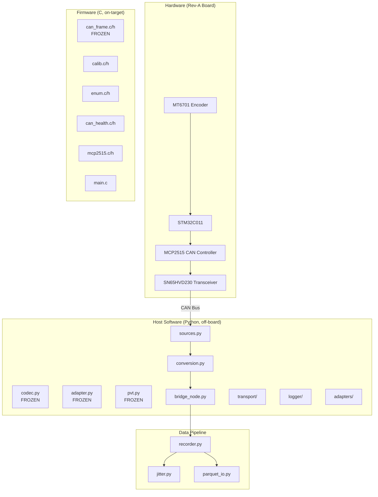

# System Architecture

## Overview

Inhabit's architecture flows from physical sensor to ML-ready dataset. The data path is the spine of the system.

---

## End-to-End Data Flow

---

## Module Boundaries

---

## Current Implementation vs Future

| Component | Current (Rev-A) | Future |
|-----------|----------------|--------|
| Encoder | MT6701 analog -> ADC | I2C/SSI/ABZ digital |
| MCU | STM32C011 dev module (hand-soldered) | Bare chip on PCB (Rev-B) |
| CAN | MCP2515 external controller | Integrated CAN-FD peripheral |
| Motor | None (sensor node only) | Motor driver + current sensing |
| Tactile | None | MEMS mic, vibration, current spike |
| Video | None | Wrist/scene camera sync |
| Calibration | Linear fit (slope + intercept) | Multi-point nonlinear |
| Transport | Replay + SimSource | Live SocketCAN + USB-CAN |
| ROS bridge | Headless-testable node | Full Jazzy launch system |
| Export | Parquet (proprioceptive only) | Parquet + HDF5 (PVT) |

---

## Frozen Contracts

These are the integration boundaries. They exist in both firmware (C) and host (Python) and must match byte-for-byte.

| Contract | C File | Python File | Rule |
|----------|--------|-------------|------|
| CAN schema v1 | `firmware/inc/can_frame.h` | `host/inhabit_can/codec.py` | Never repurpose bytes; new telemetry = new CAN ID |
| RobotAdapter | -- | `host/inhabit_can/adapter.py` | Never branch on robot type in core |
| PVTSample | -- | `host/inhabit_can/pvt.py` | Bump version + migration only |
| JointPodState | -- | `host/inhabit_msgs/` | Message fields match PodFields |

---

## Timing Assumptions

- CAN telemetry rate: ~1 kHz (firmware `tick_1khz` drives TX)
- Host receive timestamp: `time.monotonic_ns()` at RX (NEVER wall clock)
- Jitter budget: p99 < 2 ms, no gaps > 2.5x period, no backwards intervals
- Episodes exceeding budget are quarantined, not exported
- Video sync (future): align camera frames via monotonic timestamp

---

## Failure Modes

| Failure | Detection | Response |
|---------|-----------|----------|
| SPI timeout | `ST_SPI_FAULT` flag | Loop keeps running; flag visible in CAN telemetry |
| CAN TX/RX timeout | `ST_CAN_FAULT` flag | Non-sticky: cleared on healthy round-trip |
| ADC out of range | `ST_ADC_FAULT` flag | Published in telemetry; downstream filters |
| Magnet out of bounds | `ST_MAGNET_OOB` flag | Indicates encoder reliability issue |
| Bad checksum | `checksum_valid=False` in JointPodState | Still published (fail loud); quarantine at episode level |
| Jitter exceeded | `JitterBudget.check()` | Episode quarantined (sidecar JSON records why) |
| Crash mid-write | `.parquet.part` temp file | Atomic rename never completes; readers see nothing |
| ENUM race | Debounce + post-ENUM_DONE guard | Late/duplicate peer frames ignored |
| Chain overflow | `chain_index > 0xFE` | Stays un-enumerated, fault loud |

---

## Related Files

- `firmware/src/main.c` -- firmware main loop
- `firmware/src/can_frame.c` -- CAN v1 codec (C)
- `host/inhabit_can/codec.py` -- CAN v1 codec (Python)
- `host/inhabit_bridge/bridge_node.py` -- ROS 2 bridge
- `host/inhabit_bridge/sources.py` -- CAN source abstraction
- `host/inhabit_bridge/conversion.py` -- frame-to-fields mapping
- `host/logger/recorder.py` -- episode recorder
- `host/logger/jitter.py` -- jitter measurement
- `host/logger/parquet_io.py` -- parquet I/O
- `host/inhabit_can/adapter.py` -- RobotAdapter
- `host/inhabit_can/pvt.py` -- PVTSample schema
