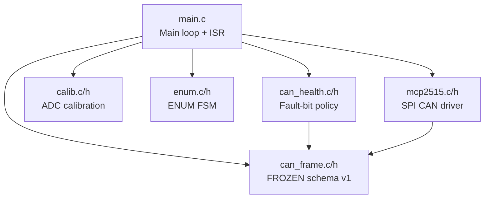

# Firmware Architecture -- STM32C011 Joint Pod

## Overview

Bare-metal C firmware for the Rev-A smart joint sensor node. Runs on STM32C011F6P6. Communicates joint angle data over CAN bus via an external MCP2515 controller.

---

## Module Map



### `firmware/src/main.c`
- Main loop skeleton with flag-driven architecture
- ISR handlers (EXTI4_15 for MCP2515 /INT on PB6)
- Board initialization: GPIO, SPI, MCP2515 (loopback mode), EXTI
- TX path (`can_tx_tick`): packs state -> MCP2515 TXB0, polls for completion
- RX path (`can_rx_service`): reads RXB0, verifies loopback echo, applies health policy
- ADC reading stub (`encoder_read_raw`): TBD, will oversample + filter
- ENUM wired: `enum_tick()` calls `enum_step()` + drives ENUM_OUT (PA2) every main-loop iteration; `can_rx_service()` feeds peer chain_index to `enum_notify_peer()` on valid v1 frames

### `firmware/src/can_frame.c` / `firmware/inc/can_frame.h` (FROZEN)
- CAN schema v1 pack/unpack
- XOR checksum (bytes 0..6)
- Status flag definitions (ADC_FAULT, SPI_FAULT, CAN_FAULT, MAGNET_OOB, NOT_ENUMERATED, CALIB_INVALID)
- `inhabit_can_id(node_id)` = `0x100 + node_id`
- `inhabit_pack()` / `inhabit_unpack()`

### `firmware/src/calib.c` / `firmware/inc/calib.h`
- `inhabit_calib_adc_to_millideg()`: linear fit `raw * slope + intercept`
- `inhabit_calib_fit_linear()`: least-squares from calibration samples
- Calibration telemetry: separate CAN ID block (`0x300 + node_id`), 8-byte payload
- `inhabit_calib_pack()` / `inhabit_calib_unpack()`

### `firmware/src/can_health.c` / `firmware/inc/can_health.h`
- `can_health_apply(flags, status, roundtrip_ok)`: uniform fault-bit policy
- **Non-sticky:** healthy round-trip clears BOTH `ST_SPI_FAULT` and `ST_CAN_FAULT`
- SPI error -> set `ST_SPI_FAULT`; other failure -> set `ST_CAN_FAULT`

### `firmware/src/enum.c` / `firmware/inc/enum.h`
- ENUM state machine: `ENUM_WAIT` -> `ENUM_DEBOUNCE` -> `ENUM_ASSIGNED` -> `ENUM_DONE`
- `enum_init()`: initialize context
- `enum_step()`: advance FSM, assign `chain_index`, drive `enum_out`
- `enum_notify_peer()`: ISR-safe, latches observed peer index
- Debounce: 10 ticks; output delay: 5 ticks
- Chain overflow guard: index > 0xFE -> stays un-enumerated
- Post-ENUM_DONE guard: late/duplicate peer traffic ignored

### `firmware/drivers/mcp2515.c` / `firmware/inc/mcp2515.h`
- SPI primitives: `reset`, `read_reg`, `write_reg`, `bit_modify`
- Mode control: `set_mode` (verify via CANSTAT readback)
- Init: reset -> config mode -> write CNF1/2/3 (500 kbps at 16 MHz) -> set RXB0CTRL -> enable interrupts -> requested mode
- TX: `send_std` (load TXB0 + RTS) + `poll_tx_done` (bounded TXREQ poll)
- RX: `poll_recv` (check CANINTF RX0IF, read RXB0, clear flag)
- SID encoding: `encode_sid` (11-bit ID split into SIDH/SIDL)

---

## Interrupt Policy

- **MCP2515 /INT on PB6:** EXTI line 6, falling edge, pull-up
- **ISR (`EXTI4_15_IRQHandler`):** Sets `flag_can_int = 1`, clears pending bit. That's it.
- **No SPI in ISRs.** No blocking. No HAL_Delay. (House rule.)
- ISRs set flags; main loop acts on them.

### Flag-Driven Main Loop

```c
for (;;) {
    if (flag_adc_ready) { read encoder; flag_adc_ready = 0; }
    if (flag_can_int)   { can_rx_service(); flag_can_int = 0; }
    if (tick_1khz)      { can_tx_tick(); tick_1khz = 0; }
    enum_tick();  /* wrapper: enum_step() + drive ENUM_OUT (PA2) */
}
```

`enum_tick()` is a thin wrapper in main.c that calls `enum_step()` with the current
ENUM_IN level, then drives ENUM_OUT from `ctx->enum_out`. `can_rx_service()` feeds
peer chain_index to `enum_notify_peer()` on valid v1 frames.

No double-service race: RX only from /INT flag, TX only from tick.

---

## PB6 /INT Assumption

**CONFIRMED** against schematic. MCP2515 /INT is routed to STM32 PB6.
- PB6 = GPIO input, pull-up
- EXTI line 6, source = Port B
- Falling edge trigger (/INT is active-low, open-drain)
- EXTI4_15_IRQn shared handler (lines 4-15 on STM32C0)

---

## Status Flags (Non-Sticky Fault Policy)

| Bit | Flag | Set When | Cleared When |
|-----|------|----------|--------------|
| 0 | `ST_ADC_FAULT` | ADC out of range | TBD |
| 1 | `ST_SPI_FAULT` | SPI transfer fails | Healthy CAN round-trip |
| 2 | `ST_CAN_FAULT` | Mode/TX/RX timeout, bad echo | Healthy CAN round-trip |
| 3 | `ST_MAGNET_OOB` | Encoder magnet out of bounds | TBD |
| 4 | `ST_NOT_ENUMERATED` | Power-on default | ENUM assigns chain_index |
| 5 | `ST_CALIB_INVALID` | No valid calibration | Valid calibration loaded |

---

## Test Strategy

All tests run on the **host** (not on-target) using mock SPI/hardware:

| Test | File | Coverage |
|------|------|----------|
| CAN frame pack/unpack | `test_can_frame.c` | 5000 round-trips + bitflip edge cases |
| Calibration | `test_calib.c` | Linear fit, telemetry pack/unpack, calib CAN ID |
| MCP2515 loopback | `test_mcp2515.c` | Init, TX, RX, register access via mock SPI |
| CAN health | `test_can_health.c` | Fault-bit transitions for all status combos |
| ENUM FSM | `test_enum.c` | 12 tests: state transitions, debounce, peer notify, chain overflow (0xFE), 7-pod chain, ISR latch, post-DONE guard |
| ENUM integration | `test_enum_integrate.c` | FSM→pack→frame: chain_index reaches wire, pre-enum fail-loud |
| 3-pod bench harness | `test_bench_3pod.c` | Golden-reference CAN frames for bench verification, partial-chain fault |

Build via `scripts/verify.ps1` (recommended) or `make -C firmware/test`. Each test links only its required sources:

```bash
gcc -Wall -Wextra -std=c11 -I../inc test_enum.c ../src/enum.c ../src/can_frame.c -o t && ./t
gcc -Wall -Wextra -std=c11 -I../inc test_mcp2515.c ../drivers/mcp2515.c ../src/can_frame.c -o t && ./t
```

---

## Timing Risks

- SPI clock too fast for MCP2515 (max 10 MHz SPI clock at 5V, check 3.3V spec)
- ADC sampling rate vs main loop rate: oversample budget TBD
- ENUM debounce timing vs CAN propagation delay
- Loopback-to-normal mode transition: verify TXREQ behavior changes

---

## Future Firmware Work

- Implement `encoder_read_raw()` with real ADC + filtering
- ~~Wire the existing `enum_step()` helper into the main loop~~ (DONE: `enum_tick()` in main.c, PR #10)
- Implement `board_init()` HAL/LL peripheral setup (clocks, GPIO, ADC, SPI)
- Add SysTick for `tick_1khz`
- Add watchdog (IWDG) for fault recovery
- CAN error frame handling (EFLG register)
- Normal mode bring-up (after loopback validated)
- Power management / sleep modes

---

## Related Files

- `firmware/CLAUDE.md` -- firmware-local rules
- `firmware/src/` -- all source files
- `firmware/inc/` -- all headers
- `firmware/drivers/` -- MCP2515 driver
- `firmware/test/` -- host-side unit tests
