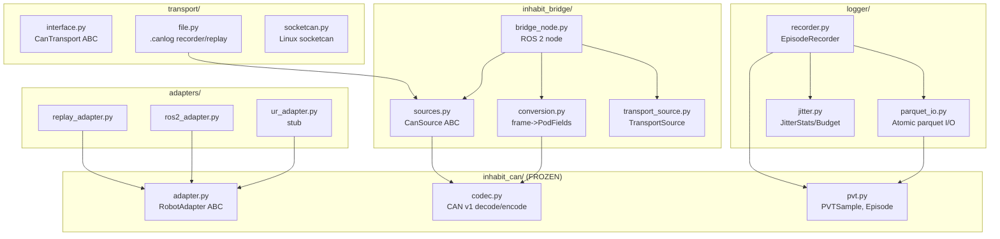

# Host Software Architecture

## Overview

Python 3.11+, type-hinted, ROS 2 Jazzy. Everything that runs off-board: CAN bridge, robot adapters, PVT episode logger, dataset export, visualization.

---

## Module Map

---

## Module Details

### `host/inhabit_can/codec.py` (FROZEN)
- `State` dataclass: `angle_raw_adc`, `angle_millideg`, `node_id`, `chain_index`, `status_flags`, `valid`
- `encode_state(s) -> (can_id, bytes)`: pack State to 8-byte CAN frame
- `decode_state(data) -> State`: unpack 8-byte frame, verify XOR checksum
- Status flag constants: `ST_ADC_FAULT`, `ST_SPI_FAULT`, etc.
- `PROTO_VERSION = 1`, `BASE_ID = 0x100`

### `host/inhabit_can/adapter.py` (FROZEN)
- `RobotAdapter` ABC: `connect()`, `read_state()`, `send_command()`, `capabilities()`
- `RobotState`: `joint_angles: list[float]`, `timestamp_ns: int`
- `RobotCommand`: `joint_targets: list[float]`
- `Capabilities`: `dof: int`, `has_force_feedback: bool`
- `SimAdapter`: zero-hardware adapter for pipeline testing

### `host/inhabit_can/pvt.py` (FROZEN)
- `PVTSample`: one time-aligned PVT row with schema versioning
- `Episode`: atomic, append-only sample collection
- `JointPodState`: upstream contract from bridge node
- `sample_from_pod_state()`: maps decoded joint state to PVT sample
- `MIGRATIONS` dict + `migrate_row()`: upgrade old schema versions

### `host/inhabit_bridge/sources.py`
- `CanFrame`: `can_id`, `data`, `rx_monotonic_ns`
- `CanSource` ABC: `open()`, `frames()`, `close()`
- `ReplaySource`: replays pre-captured raw frames (headless, zero hardware)
- `SimSource`: synthesizes valid frames with sweeping angle
- `SocketCanSource`: real hardware via python-can (lazy import)

### `host/inhabit_bridge/conversion.py`
- `PodFields`: ROS-independent mirror of JointPodState payload
- `fields_from_state()`: codec State -> PodFields (adds `angle_rad`, `schema_version`)
- `fields_from_frame()`: raw bytes -> PodFields (decode + map)

### `host/inhabit_bridge/bridge_node.py`
- `CanBridgeNode`: ROS 2 node, worker thread reads from CanSource
- Publishes `JointPodState` on configurable topic
- QoS: BEST_EFFORT, KEEP_LAST(10), VOLATILE (sensor-style telemetry)
- Bad-checksum frames are still published (fail loud, Track 3 sees corruption)
- Time-sync: `header.stamp` = monotonic host RX clock (NEVER wall clock)

### `host/inhabit_bridge/transport_source.py`
- `TransportSource`: bridge between the transport layer and the bridge's `CanSource` interface
- Supports replayed file transport and other transport-backed reads
- Regression coverage lives in `host/inhabit_bridge/tests/test_transport_source.py`

### `host/transport/interface.py`
- `CanTransport` ABC: `open()`, `close()`, `send()`, `recv()`
- Bidirectional (unlike read-only CanSource)

### `host/transport/file.py`
- `FileRecorder`: append CanFrames to `.canlog` (JSONL format)
- `FileReplayTransport`: replay `.canlog` as CanTransport
- `.canlog` format: `{"v":1, "t_ns":..., "id":..., "data":"hex..."}`
- Versioned (`CANLOG_VERSION = 1`)

### `host/transport/socketcan.py`
- `SocketCanTransport`: bidirectional CAN over Linux socketcan
- Lazy python-can import
- 8-byte frame validation at `send()` boundary

### `host/logger/recorder.py`
- `EpisodeRecorder`: open -> ingest (append-only) -> finalize (measure/gate/export or quarantine)
- Jitter budget gate: p99 < 2ms, no gaps > 2.5x period, no backwards, min 2 samples
- Quarantine: sidecar JSON in `<out_dir>/quarantine/`, no parquet written
- Export: atomic parquet via `write_episode()`
- Accepts `JointPodState` or dict (coercion)

### `host/logger/jitter.py`
- `compute_jitter(timestamps_ns)`: measures inter-sample timing quality
- `JitterStats`: `n_samples`, `period_ns`, `jitter_p99_ns`, `jitter_max_ns`, `dropouts`, `backwards`
- `JitterBudget`: documented defaults (2ms p99, 2.5x gap, min 2 samples)
- Pure stdlib, no external dependencies

### `host/logger/parquet_io.py`
- `write_episode()`: atomic write (.part + os.replace + fsync)
- `read_episode()`: read + migrate via PVTSample.from_row
- Explicit Arrow schema matching SAMPLE_COLUMNS
- Footer metadata: episode_id, schema_version, task_label, jitter_stats, budget, detector_version

### `host/adapters/replay_adapter.py`
- `ReplayAdapter`: feeds recorded RobotStates through adapter interface
- Validates: non-empty, consistent DOF, positive monotonic timestamps
- Deep-copies for determinism

### `host/adapters/ur_adapter.py`
- `URAdapter`: stub for future Universal Robots RTDE integration
- `connect()`, `read_state()`, `send_command()` raise `NotImplementedError`
- `capabilities()` works (returns DOF, no force feedback)

---

## Frozen Contracts

| Contract | File | Rule |
|----------|------|------|
| CAN schema v1 | `host/inhabit_can/codec.py` | Never change byte layout |
| RobotAdapter | `host/inhabit_can/adapter.py` | Never branch on robot type in core |
| PVTSample | `host/inhabit_can/pvt.py` | Bump version + migration only |
| JointPodState | `host/inhabit_msgs/` | Fields match PodFields |

---

## Test Strategy

Tests in `host/tests/`. Run with `pytest host -q`.

CI enforces:
- `ruff check` (blocking)
- `mypy .` (blocking, strict)
- `pytest` (blocking)

---

## Failure Modes

| Failure | Detection | Response |
|---------|-----------|----------|
| Bad CAN checksum | `checksum_valid=False` | Published (fail loud), downstream filters |
| Jitter exceeded | `JitterBudget.check()` fails | Episode quarantined |
| Crash mid-write | `.parquet.part` temp | Atomic rename never completes |
| Schema drift | `PROTO_VERSION` mismatch | Migration or reader upgrade error |
| Missing python-can | Import error at runtime | Headless/replay path still works |

---

## Related Paths

- `host/CLAUDE.md` -- host-local rules
- `host/pyproject.toml` -- Python project config
- `host/inhabit_bridge/launch/` -- ROS 2 launch files
- `host/inhabit_msgs/` -- ROS 2 message definitions
- `host/tests/` -- pytest tests
