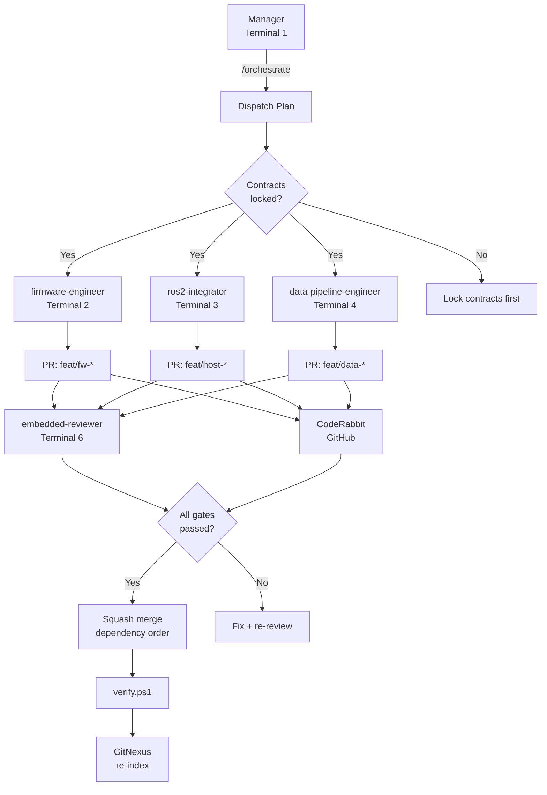

# Agent Workflow Map

## Documents

- [[docs/agents/Agent Operating Model|Agent Operating Model]]
- [[docs/sop/development/Autonomous Development SOP|Autonomous Development SOP]]
- [[docs/sop/review/PR Review and Merge SOP|PR Review & Merge SOP]]
