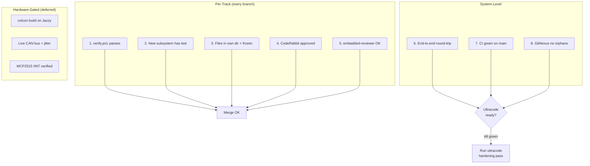

# Benchmark Map

```mermaid
flowchart TD
    subgraph PerTrack["Per-Track (every branch)"]
        B1[1. verify.ps1 passes]
        B2[2. New subsystem has test]
        B3[3. Files in own dir + frozen]
        B4[4. CodeRabbit approved]
        B5[5. embedded-reviewer OK]
    end

    subgraph System["System-Level"]
        B6[6. End-to-end round-trip]
        B7[7. CI green on main]
        B8[8. GitNexus no orphans]
    end

    subgraph HW["Hardware-Gated (deferred)"]
        BH1[colcon build on Jazzy]
        BH2[Live CAN bus + jitter]
        BH3[MCP2515 /INT verified]
    end

    B1 --> MERGE[Merge OK]
    B2 --> MERGE
    B3 --> MERGE
    B4 --> MERGE
    B5 --> MERGE

    B6 --> ULTRA{Ultracode<br>ready?}
    B7 --> ULTRA
    B8 --> ULTRA
    ULTRA -->|All green| UC[Run ultracode<br>hardening pass]
```

## Documents

- [[docs/benchmarks/Benchmark Execution Plan|Benchmark Execution Plan]]
- [[docs/sop/release/Release and Handoff SOP|Release SOP]]
