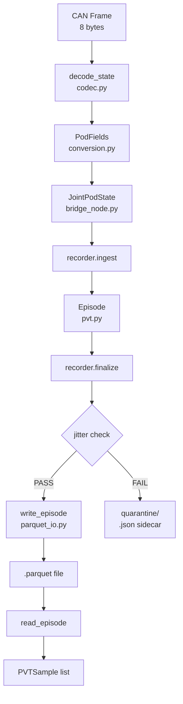

# Data Pipeline Map

## Documents

- [[docs/data/PVT Data Pipeline|PVT Data Pipeline]]
- [[docs/decisions/0005-PVT-Data-Pipeline|ADR-0005]]
- [[docs/checklists/Data Logging Checklist|Data Logging Checklist]]
