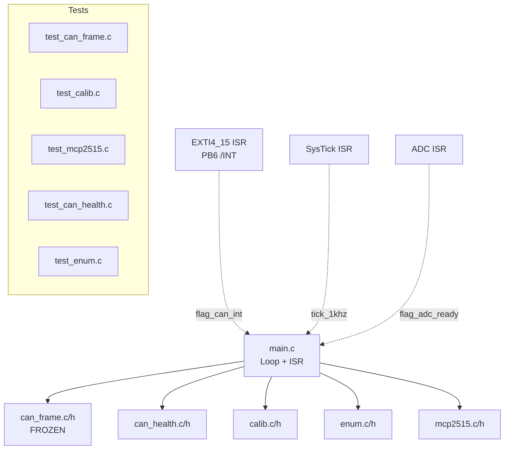

# Firmware Stack Map

## Documents

- [[docs/firmware/Firmware Architecture|Firmware Architecture]]
- [[docs/firmware/Firmware SOP|Firmware SOP]]
- [[docs/decisions/0001-CAN-Schema-v1|CAN Schema v1]]
- [[docs/decisions/0002-ENUM-Protocol|ENUM Protocol]]
- [[docs/decisions/0004-MCP2515-SPI-CAN-Architecture|MCP2515 Architecture]]
