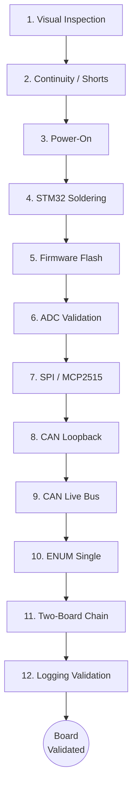

# Hardware Bringup Map

Each stage has pass/fail criteria. Do not proceed if a stage fails.

## Documents

- [[docs/hardware/bringup/Hardware Bring-Up SOP|Hardware Bring-Up SOP]]
- [[docs/sop/hardware/Hardware Test SOP|Hardware Test SOP]]
- [[docs/checklists/Before First Power Checklist|Before First Power]]
- [[docs/checklists/Firmware Bringup Checklist|Firmware Bringup]]
- [[docs/checklists/CAN Bringup Checklist|CAN Bringup]]
- [[docs/checklists/ENUM Bringup Checklist|ENUM Bringup]]
