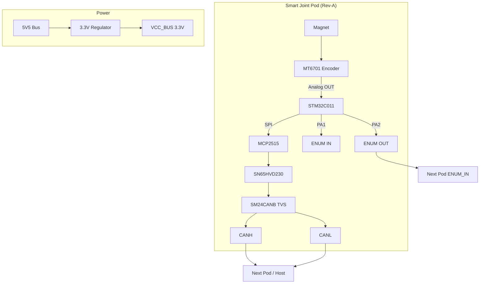

# Hardware Stack Map

## Documents

- [[docs/hardware/Hardware Stack|Hardware Stack]]
- [[docs/hardware/bringup/Hardware Bring-Up SOP|Bring-Up SOP]]
- [[docs/hardware/pcba/PCBA and Fabrication SOP|PCBA SOP]]
- [[docs/risks/Risk Register|Risk Register]]
