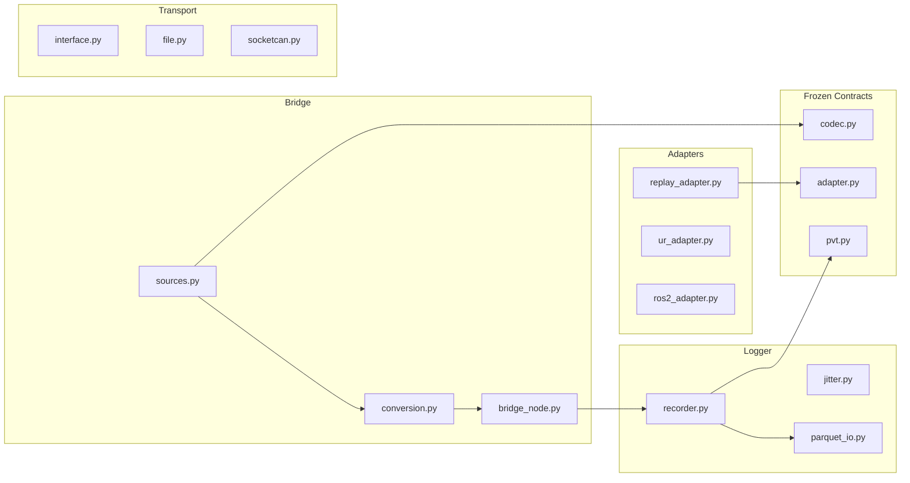

# Host Software Map

## Documents

- [[docs/host/Host Software Architecture|Host Software Architecture]]
- [[docs/sop/software/Verification SOP|Verification SOP]]
- [[docs/decisions/0006-RobotAdapter-Frozen-Contract|RobotAdapter]]
