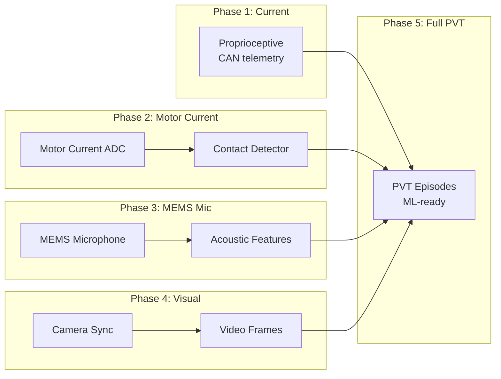

# Last Centimeter Map

## Documents

- [[docs/last-centimeter/Last Centimeter Data Thesis|Last Centimeter Data Thesis]]
- [[docs/teleop/Universal Teleop Kernel|Universal Teleop Kernel]]
- [[docs/data/PVT Data Pipeline|PVT Data Pipeline]]
- [[docs/decisions/0009-Last-Centimeter-Data-Thesis|ADR-0009]]
