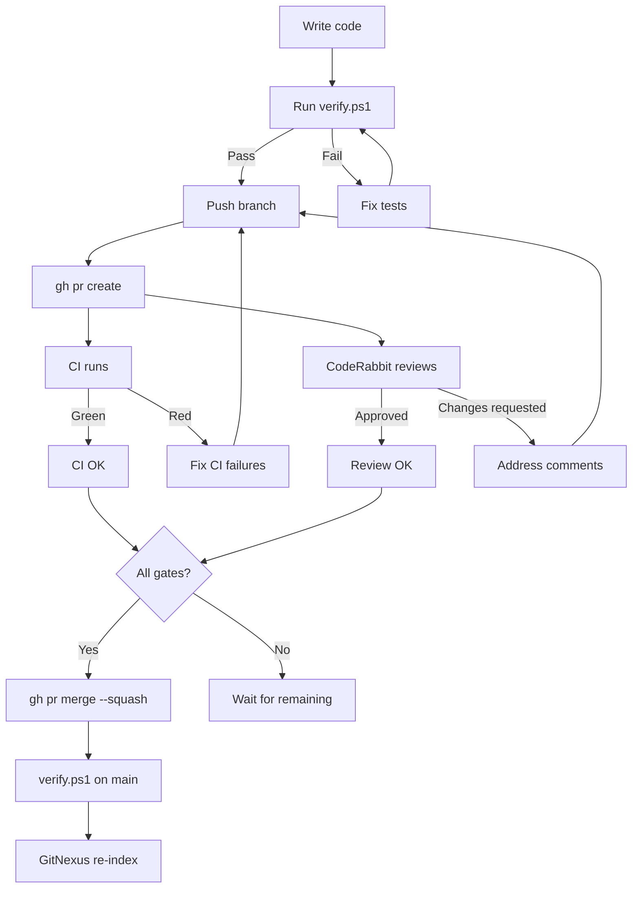

# PR Workflow Map

## Merge Order Rule
Schema-defining track first:
1. Firmware (CAN frame producers)
2. Host (CAN frame consumers)
3. Data (PVT consumers)
4. Docs / viz

## Documents

- [[docs/sop/review/PR Review and Merge SOP|PR Review & Merge SOP]]
- [[docs/checklists/Before Merge Checklist|Before Merge Checklist]]
