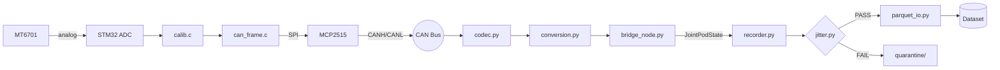

# System Architecture Map

## Data Flow

## Key Documents

- [[docs/architecture/System Architecture|Full Architecture]]
- [[docs/hardware/Hardware Stack|Hardware Stack]]
- [[docs/firmware/Firmware Architecture|Firmware Architecture]]
- [[docs/host/Host Software Architecture|Host Software Architecture]]
- [[docs/data/PVT Data Pipeline|PVT Data Pipeline]]

## Frozen Contracts

- [[docs/decisions/0001-CAN-Schema-v1|CAN Schema v1]] -- `can_frame.h` / `codec.py`
- [[docs/decisions/0006-RobotAdapter-Frozen-Contract|RobotAdapter]] -- `adapter.py`
- [[docs/decisions/0005-PVT-Data-Pipeline|PVTSample]] -- `pvt.py`
